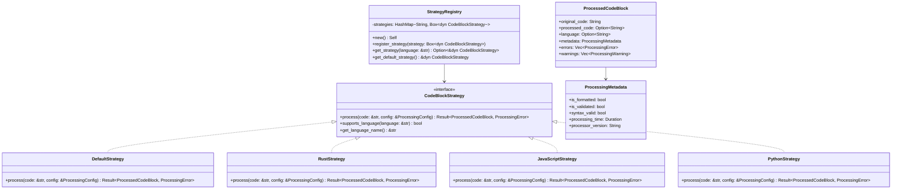

# 代码块策略模式设计文档

## 概述

本设计文档描述了如何在Markdown解析器中实现策略模式来处理不同类型的代码块。设计将扩展现有的AST结构，添加策略接口和处理器，以支持语言特定的代码块处理逻辑。

## 架构

### 核心组件



### 数据模型扩展

#### 扩展的CodeBlock结构

```rust
#[derive(Debug, Clone)]
pub enum MarkdownElement {
    // ... 现有元素 ...
    CodeBlock {
        language: Option<String>,
        code: String,
        processed: Option<ProcessedCodeBlock>,
    },
}
```

#### 新增数据结构

```rust
#[derive(Debug, Clone)]
pub struct ProcessedCodeBlock {
    pub original_code: String,
    pub processed_code: Option<String>,
    pub language: Option<String>,
    pub metadata: ProcessingMetadata,
    pub errors: Vec<ProcessingError>,
    pub warnings: Vec<ProcessingWarning>,
}

#[derive(Debug, Clone)]
pub struct ProcessingMetadata {
    pub is_formatted: bool,
    pub is_validated: bool,
    pub syntax_valid: bool,
    pub processing_time: std::time::Duration,
    pub processor_version: String,
    pub custom_attributes: std::collections::HashMap<String, String>,
}

#[derive(Debug, Clone)]
pub struct ProcessingConfig {
    pub enable_syntax_validation: bool,
    pub enable_formatting: bool,
    pub enable_optimization: bool,
    pub timeout_ms: u64,
    pub custom_options: std::collections::HashMap<String, String>,
}
```

## 组件和接口

### 1. CodeBlockStrategy 接口

策略接口定义了所有代码块处理器必须实现的方法：

```rust
pub trait CodeBlockStrategy: Send + Sync {
    /// 处理代码块
    fn process(&self, code: &str, config: &ProcessingConfig) -> Result<ProcessedCodeBlock, ProcessingError>;
    
    /// 检查是否支持指定语言
    fn supports_language(&self, language: &str) -> bool;
    
    /// 获取策略支持的主要语言名称
    fn get_language_name(&self) -> &'static str;
    
    /// 获取策略的优先级（用于冲突解决）
    fn get_priority(&self) -> u8 {
        100 // 默认优先级
    }
    
    /// 获取策略的版本信息
    fn get_version(&self) -> &'static str {
        "1.0.0"
    }
}
```

### 2. StrategyRegistry 注册表

管理所有可用的代码块处理策略：

```rust
pub struct StrategyRegistry {
    strategies: std::collections::HashMap<String, Box<dyn CodeBlockStrategy>>,
    default_strategy: Box<dyn CodeBlockStrategy>,
}

impl StrategyRegistry {
    pub fn new() -> Self {
        let mut registry = Self {
            strategies: std::collections::HashMap::new(),
            default_strategy: Box::new(DefaultStrategy::new()),
        };
        
        // 注册内置策略
        registry.register_builtin_strategies();
        registry
    }
    
    pub fn register_strategy(&mut self, strategy: Box<dyn CodeBlockStrategy>) {
        let language = strategy.get_language_name().to_lowercase();
        self.strategies.insert(language, strategy);
    }
    
    pub fn get_strategy(&self, language: &str) -> &dyn CodeBlockStrategy {
        let normalized_lang = language.to_lowercase();
        self.strategies
            .get(&normalized_lang)
            .map(|s| s.as_ref())
            .unwrap_or(self.default_strategy.as_ref())
    }
    
    fn register_builtin_strategies(&mut self) {
        self.register_strategy(Box::new(RustStrategy::new()));
        self.register_strategy(Box::new(JavaScriptStrategy::new()));
        self.register_strategy(Box::new(PythonStrategy::new()));
        self.register_strategy(Box::new(SqlStrategy::new()));
        self.register_strategy(Box::new(JsonStrategy::new()));
    }
}
```

### 3. 具体策略实现

#### DefaultStrategy - 默认策略

```rust
pub struct DefaultStrategy;

impl CodeBlockStrategy for DefaultStrategy {
    fn process(&self, code: &str, config: &ProcessingConfig) -> Result<ProcessedCodeBlock, ProcessingError> {
        let start_time = std::time::Instant::now();
        
        let processed = ProcessedCodeBlock {
            original_code: code.to_string(),
            processed_code: None, // 不进行任何处理
            language: None,
            metadata: ProcessingMetadata {
                is_formatted: false,
                is_validated: false,
                syntax_valid: true, // 假设有效
                processing_time: start_time.elapsed(),
                processor_version: self.get_version().to_string(),
                custom_attributes: std::collections::HashMap::new(),
            },
            errors: Vec::new(),
            warnings: Vec::new(),
        };
        
        Ok(processed)
    }
    
    fn supports_language(&self, _language: &str) -> bool {
        true // 支持所有语言作为回退
    }
    
    fn get_language_name(&self) -> &'static str {
        "default"
    }
}
```

#### RustStrategy - Rust代码处理

```rust
pub struct RustStrategy;

impl CodeBlockStrategy for RustStrategy {
    fn process(&self, code: &str, config: &ProcessingConfig) -> Result<ProcessedCodeBlock, ProcessingError> {
        let start_time = std::time::Instant::now();
        let mut errors = Vec::new();
        let mut warnings = Vec::new();
        
        // 语法验证
        let syntax_valid = if config.enable_syntax_validation {
            self.validate_rust_syntax(code, &mut errors)
        } else {
            true
        };
        
        // 代码格式化
        let formatted_code = if config.enable_formatting && syntax_valid {
            match self.format_rust_code(code) {
                Ok(formatted) => Some(formatted),
                Err(e) => {
                    warnings.push(ProcessingWarning::new("formatting_failed", &e.to_string()));
                    None
                }
            }
        } else {
            None
        };
        
        let processed = ProcessedCodeBlock {
            original_code: code.to_string(),
            processed_code: formatted_code,
            language: Some("rust".to_string()),
            metadata: ProcessingMetadata {
                is_formatted: formatted_code.is_some(),
                is_validated: config.enable_syntax_validation,
                syntax_valid,
                processing_time: start_time.elapsed(),
                processor_version: self.get_version().to_string(),
                custom_attributes: std::collections::HashMap::new(),
            },
            errors,
            warnings,
        };
        
        Ok(processed)
    }
    
    fn supports_language(&self, language: &str) -> bool {
        matches!(language.to_lowercase().as_str(), "rust" | "rs")
    }
    
    fn get_language_name(&self) -> &'static str {
        "rust"
    }
}
```

## 数据模型

### ProcessingError 和 ProcessingWarning

```rust
#[derive(Debug, Clone)]
pub struct ProcessingError {
    pub error_type: String,
    pub message: String,
    pub line: Option<usize>,
    pub column: Option<usize>,
    pub severity: ErrorSeverity,
}

#[derive(Debug, Clone)]
pub struct ProcessingWarning {
    pub warning_type: String,
    pub message: String,
    pub line: Option<usize>,
    pub column: Option<usize>,
}

#[derive(Debug, Clone)]
pub enum ErrorSeverity {
    Low,
    Medium,
    High,
    Critical,
}
```

## 错误处理

### 错误处理策略

1. **策略处理失败**：回退到默认策略
2. **语法验证失败**：记录错误但保留原始代码
3. **格式化失败**：记录警告但保留原始代码
4. **处理超时**：中断处理并使用原始代码

### 超时机制

```rust
use std::time::{Duration, Instant};

impl CodeBlockProcessor {
    fn process_with_timeout(&self, code: &str, config: &ProcessingConfig) -> Result<ProcessedCodeBlock, ProcessingError> {
        let timeout = Duration::from_millis(config.timeout_ms);
        let start = Instant::now();
        
        // 使用线程或异步任务来实现超时
        // 这里简化为同步检查
        if start.elapsed() > timeout {
            return Err(ProcessingError::timeout());
        }
        
        // 实际处理逻辑...
        Ok(ProcessedCodeBlock::default())
    }
}
```

## 测试策略

### 单元测试

1. **策略接口测试**：验证每个策略的基本功能
2. **注册表测试**：验证策略注册和查找
3. **错误处理测试**：验证各种错误情况的处理
4. **性能测试**：验证处理性能和超时机制

### 集成测试

1. **端到端测试**：从Markdown解析到代码块处理的完整流程
2. **多语言测试**：验证不同编程语言的处理
3. **配置测试**：验证不同配置选项的效果

## 性能考虑

### 优化策略

1. **延迟加载**：只在需要时加载特定语言的处理器
2. **缓存机制**：缓存处理结果以避免重复处理
3. **并行处理**：对于多个代码块，支持并行处理
4. **内存管理**：及时释放不需要的处理结果

### 内存使用

```rust
pub struct CodeBlockCache {
    cache: std::collections::LruCache<String, ProcessedCodeBlock>,
    max_size: usize,
}

impl CodeBlockCache {
    pub fn new(max_size: usize) -> Self {
        Self {
            cache: std::collections::LruCache::new(max_size),
            max_size,
        }
    }
    
    pub fn get_or_process<F>(&mut self, key: &str, processor: F) -> Result<ProcessedCodeBlock, ProcessingError>
    where
        F: FnOnce() -> Result<ProcessedCodeBlock, ProcessingError>,
    {
        if let Some(cached) = self.cache.get(key) {
            Ok(cached.clone())
        } else {
            let result = processor()?;
            self.cache.put(key.to_string(), result.clone());
            Ok(result)
        }
    }
}
```

## 扩展性设计

### 插件系统

```rust
pub trait CodeBlockPlugin {
    fn name(&self) -> &str;
    fn version(&self) -> &str;
    fn create_strategy(&self) -> Box<dyn CodeBlockStrategy>;
}

pub struct PluginManager {
    plugins: Vec<Box<dyn CodeBlockPlugin>>,
}

impl PluginManager {
    pub fn load_plugin(&mut self, plugin: Box<dyn CodeBlockPlugin>) {
        self.plugins.push(plugin);
    }
    
    pub fn register_all_strategies(&self, registry: &mut StrategyRegistry) {
        for plugin in &self.plugins {
            let strategy = plugin.create_strategy();
            registry.register_strategy(strategy);
        }
    }
}
```

### 配置系统

```rust
#[derive(Debug, Clone, serde::Deserialize)]
pub struct CodeBlockConfig {
    pub global: GlobalConfig,
    pub languages: std::collections::HashMap<String, LanguageConfig>,
}

#[derive(Debug, Clone, serde::Deserialize)]
pub struct GlobalConfig {
    pub enable_processing: bool,
    pub default_timeout_ms: u64,
    pub max_cache_size: usize,
}

#[derive(Debug, Clone, serde::Deserialize)]
pub struct LanguageConfig {
    pub enable_syntax_validation: bool,
    pub enable_formatting: bool,
    pub custom_options: std::collections::HashMap<String, String>,
}
```

这个设计提供了一个灵活、可扩展的架构，支持不同编程语言的代码块处理，同时保持良好的性能和错误处理能力。