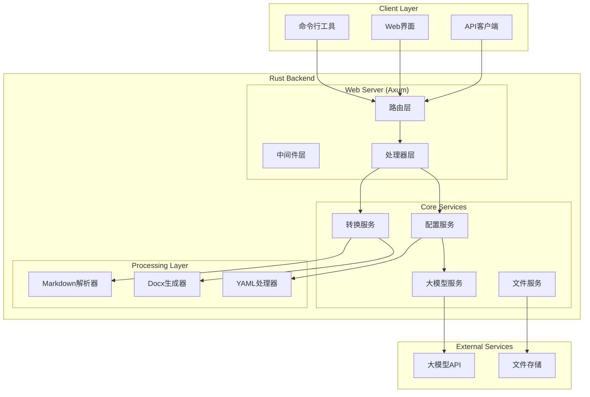

# Design Document

## Overview

本设计文档描述了一个基于Rust后端的Markdown到docx转换系统。系统采用现代化的架构设计，提供Web API、Web界面和命令行工具三种使用方式，支持通过YAML配置文件和自然语言进行灵活的转换规则定制。

## Architecture

### 技术栈选择

**后端技术栈 (Rust):**
- **Web框架**: Axum - 高性能异步Web框架，提供类型安全的路由和中间件
- **文档处理**: docx-rs - 用于生成和操作docx文件的Rust库
- **Markdown解析**: pulldown-cmark - 高性能的CommonMark解析器
- **YAML处理**: serde_yaml - 序列化和反序列化YAML配置
- **大模型集成**: reqwest + serde_json - HTTP客户端调用OpenAI/Claude等API
- **命令行**: clap - 强类型的命令行参数解析
- **异步运行时**: tokio - 异步I/O和并发处理
- **错误处理**: anyhow + thiserror - 结构化错误处理
- **日志**: tracing + tracing-subscriber - 结构化日志记录

**前端技术栈:**
- **框架**: React + TypeScript
- **构建工具**: Vite
- **UI组件**: Tailwind CSS + Headless UI
- **文件上传**: react-dropzone
- **状态管理**: Zustand

### 系统架构图



## Components and Interfaces

### 1. 核心转换引擎 (Conversion Engine)

```rust
pub struct ConversionEngine {
    config: ConversionConfig,
    markdown_parser: MarkdownParser,
    docx_generator: DocxGenerator,
}

pub trait Converter {
    async fn convert(&self, markdown: &str) -> Result<Vec<u8>, ConversionError>;
    fn update_config(&mut self, config: ConversionConfig);
}
```

**职责:**
- 协调Markdown解析和docx生成流程
- 应用配置规则进行格式转换
- 处理转换过程中的错误和异常

### 2. 配置管理服务 (Configuration Service)

```rust
pub struct ConfigurationService {
    llm_client: LlmClient,
    yaml_processor: YamlProcessor,
}

pub trait ConfigManager {
    async fn parse_config(&self, yaml: &str) -> Result<ConversionConfig, ConfigError>;
    async fn update_with_natural_language(&self, config: &ConversionConfig, prompt: &str) -> Result<ConversionConfig, ConfigError>;
    fn validate_config(&self, config: &ConversionConfig) -> Result<(), ValidationError>;
}
```

**职责:**
- 解析和验证YAML配置文件
- 通过大模型处理自然语言配置修改
- 提供配置模板和默认设置

### 3. Web API层 (Web API Layer)

```rust
// API路由定义
pub fn create_router() -> Router {
    Router::new()
        .route("/api/convert", post(convert_handler))
        .route("/api/config/update", post(update_config_handler))
        .route("/api/health", get(health_handler))
        .layer(middleware::from_fn(logging_middleware))
        .layer(middleware::from_fn(cors_middleware))
}

// 请求/响应结构
#[derive(Deserialize)]
pub struct ConvertRequest {
    pub markdown: String,
    pub config: Option<String>,
    pub natural_language: Option<String>,
}

#[derive(Serialize)]
pub struct ConvertResponse {
    pub success: bool,
    pub file_data: Option<Vec<u8>>,
    pub error: Option<String>,
}
```

### 4. 命令行接口 (CLI Interface)

```rust
#[derive(Parser)]
#[command(name = "md2docx")]
#[command(about = "Convert Markdown to docx with configurable formatting")]
pub struct Cli {
    #[arg(short, long)]
    pub input: PathBuf,
    
    #[arg(short, long)]
    pub output: Option<PathBuf>,
    
    #[arg(short, long)]
    pub config: Option<PathBuf>,
    
    #[arg(long)]
    pub config_prompt: Option<String>,
    
    #[arg(short, long)]
    pub batch: bool,
}
```

## Data Models

### 1. 转换配置模型

```rust
#[derive(Debug, Clone, Serialize, Deserialize)]
pub struct ConversionConfig {
    pub document: DocumentConfig,
    pub styles: StyleConfig,
    pub elements: ElementConfig,
}

#[derive(Debug, Clone, Serialize, Deserialize)]
pub struct DocumentConfig {
    pub page_size: PageSize,
    pub margins: Margins,
    pub default_font: FontConfig,
}

#[derive(Debug, Clone, Serialize, Deserialize)]
pub struct StyleConfig {
    pub headings: HashMap<u8, HeadingStyle>,
    pub paragraph: ParagraphStyle,
    pub code_block: CodeBlockStyle,
    pub table: TableStyle,
}

#[derive(Debug, Clone, Serialize, Deserialize)]
pub struct ElementConfig {
    pub image: ImageConfig,
    pub list: ListConfig,
    pub link: LinkConfig,
}
```

### 2. Markdown AST模型

```rust
#[derive(Debug, Clone)]
pub enum MarkdownElement {
    Heading { level: u8, content: String },
    Paragraph { content: Vec<InlineElement> },
    CodeBlock { language: Option<String>, code: String },
    Table { headers: Vec<String>, rows: Vec<Vec<String>> },
    List { ordered: bool, items: Vec<ListItem> },
    Image { alt: String, url: String },
}

#[derive(Debug, Clone)]
pub enum InlineElement {
    Text(String),
    Bold(String),
    Italic(String),
    Code(String),
    Link { text: String, url: String },
}
```

## Error Handling

### 错误类型定义

```rust
#[derive(Debug, thiserror::Error)]
pub enum ConversionError {
    #[error("Markdown parsing failed: {0}")]
    MarkdownParsing(String),
    
    #[error("Docx generation failed: {0}")]
    DocxGeneration(String),
    
    #[error("Configuration error: {0}")]
    Configuration(#[from] ConfigError),
    
    #[error("IO error: {0}")]
    Io(#[from] std::io::Error),
}

#[derive(Debug, thiserror::Error)]
pub enum ConfigError {
    #[error("Invalid YAML format: {0}")]
    InvalidYaml(String),
    
    #[error("LLM API error: {0}")]
    LlmApi(String),
    
    #[error("Validation failed: {0}")]
    Validation(String),
}
```

### 错误处理策略

1. **分层错误处理**: 每层都有特定的错误类型，向上传播时进行适当转换
2. **结构化日志**: 使用tracing记录错误上下文和堆栈信息
3. **用户友好错误**: API返回结构化错误信息，CLI显示可读的错误消息
4. **错误恢复**: 批量处理时单个文件失败不影响其他文件处理

## Testing Strategy

### 1. 单元测试

```rust
#[cfg(test)]
mod tests {
    use super::*;
    
    #[tokio::test]
    async fn test_markdown_parsing() {
        let parser = MarkdownParser::new();
        let result = parser.parse("# Hello World").await;
        assert!(result.is_ok());
    }
    
    #[test]
    fn test_config_validation() {
        let config = ConversionConfig::default();
        let service = ConfigurationService::new();
        assert!(service.validate_config(&config).is_ok());
    }
}
```

### 2. 集成测试

```rust
#[tokio::test]
async fn test_full_conversion_pipeline() {
    let app = create_test_app().await;
    let response = app
        .oneshot(
            Request::builder()
                .method("POST")
                .uri("/api/convert")
                .header("content-type", "application/json")
                .body(Body::from(r#"{"markdown": "# Test"}"#))
                .unwrap(),
        )
        .await
        .unwrap();
    
    assert_eq!(response.status(), StatusCode::OK);
}
```

### 3. 性能测试

- **负载测试**: 使用criterion.rs进行基准测试
- **内存测试**: 监控大文件处理时的内存使用
- **并发测试**: 验证多请求并发处理能力

### 4. 端到端测试

- **CLI测试**: 测试命令行工具的各种参数组合
- **Web界面测试**: 使用Playwright进行浏览器自动化测试
- **API测试**: 使用reqwest进行HTTP API测试

## 部署和运维

### 1. 容器化部署

```dockerfile
FROM rust:1.75 as builder
WORKDIR /app
COPY . .
RUN cargo build --release

FROM debian:bookworm-slim
RUN apt-get update && apt-get install -y ca-certificates
COPY --from=builder /app/target/release/md2docx-server /usr/local/bin/
EXPOSE 3000
CMD ["md2docx-server"]
```

### 2. 监控和日志

- **结构化日志**: 使用tracing输出JSON格式日志
- **指标收集**: 集成prometheus指标
- **健康检查**: 提供/health端点
- **分布式追踪**: 支持OpenTelemetry

### 3. 配置管理

- **环境变量**: 支持通过环境变量配置
- **配置文件**: 支持TOML配置文件
- **运行时配置**: 支持热重载部分配置